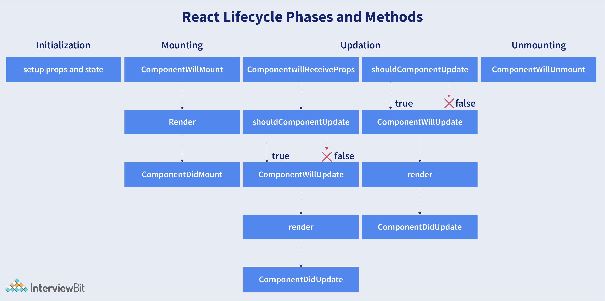

### What are the different phases of the component lifecycle?

There are four different phases in the lifecycle of React component. They are:

-   Initialization: During this phase, React component will prepare by setting up the default props and initial state for the upcoming tough journey.
-   Mounting: Mounting refers to putting the elements into the browser DOM. Since React uses VirtualDOM, the entire browser DOM which has been currently rendered would not be refreshed. This phase includes the lifecycle methods `componentWillMount` and `componentDidMount`.
-   Updating: In this phase, a component will be updated when there is a change in the state or props of a component. This phase will have lifecycle methods like `componentWillUpdate`, `shouldComponentUpdate`, `render`, and` componentDidUpdate`.
-   Unmounting: In this last phase of the component lifecycle, the component will be removed from the DOM or will be unmounted from the browser DOM. This phase will have the lifecycle method named `componentWillUnmount`.

