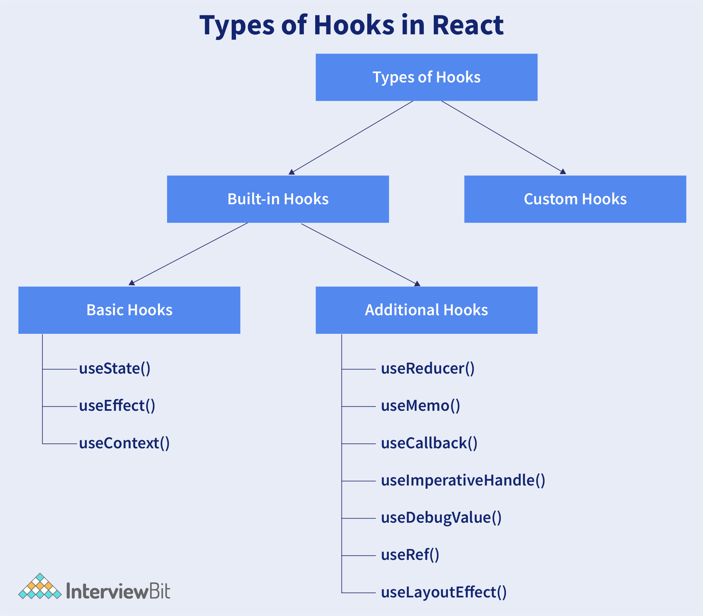

### Explain about types of Hooks in React.

There are two types of Hooks in React. They are:

1\. Built-in Hooks: The built-in Hooks are divided into 2 parts as given below:

-   Basic Hooks:
    -   `useState()`: This functional component is used to set and retrieve the state.
    -   `useEffect()`: It enables for performing the side effects in the functional components.
    -   `useContext()`: It is used for creating common data that is to be accessed by the components hierarchy without having to pass the props down to each level.
-   Additional Hooks:
    -   `useReducer()` : It is used when there is a complex state logic that is having several sub-values or when the upcoming state is dependent on the previous state. It will also enable you to optimization of component performance that will trigger deeper updates as it is permitted to pass the dispatch down instead of callbacks.
    -   `useMemo()` : This will be used for recomputing the memoized value when there is a change in one of the dependencies. This optimization will help for avoiding expensive calculations on each render.
    -   `useCallback()` : This is useful while passing callbacks into the optimized child components and depends on the equality of reference for the prevention of unneeded renders.
    -   `useImperativeHandle()`:  It will enable modifying the instance that will be passed with the ref object.
    -   `useDebugValue()`: It is used for displaying a label for custom hooks in React DevTools.
    -   `useRef()` : It will permit creating a reference to the DOM element directly within the functional component.
    -   `useLayoutEffect()`: It is used for the reading layout from the DOM and re-rendering synchronously.

2\. Custom Hooks: A custom Hook is basically a function of JavaScript. The Custom Hook working is similar to a regular function. The "use" at the beginning of the Custom Hook Name is required for React to understand that this is a custom Hook and also it will describe that this specific function follows the rules of Hooks. Moreover, developing custom Hooks will enable you for extracting component logic from within reusable functions.

